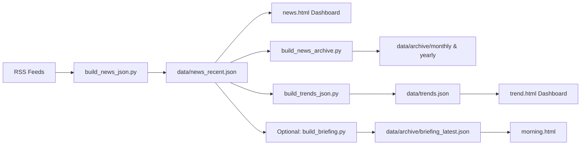
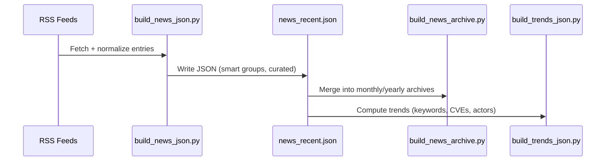
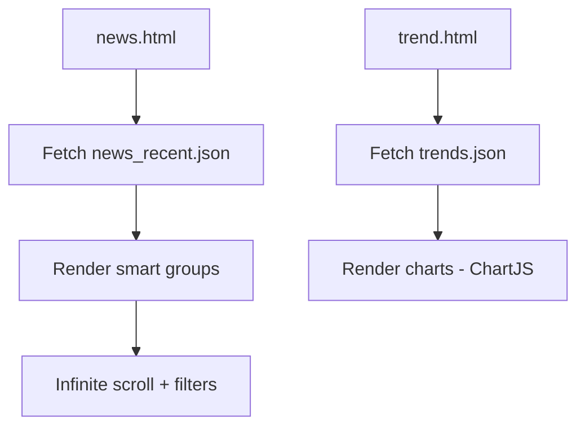

# S33R Security News Feed

[](https://github.com/clivoa/S33R/actions/workflows/update_news_json.yml)
[](https://github.com/clivoa/S33R/actions/workflows/build_news_archive.yml)
[](LICENSE)


A fully automated, open-source–friendly **cybersecurity news aggregation, normalization, archiving, and analytics platform** designed to run entirely on **GitHub Pages** + **GitHub Actions**, without servers or databases.

S33R collects content from hundreds of RSS feeds, classifies it using Smart Groups, builds trend analytics, generates historical archives, and provides multiple front-end dashboards for analysts, researchers, and OSINT practitioners.

---

## 📌 Executive Summary

S33R provides:

- A fast, filterable **News Board** fed by a prebuilt JSON cache  
- **Smart Group classification** for high-signal grouping  
- **Curated intelligence flags**  
- **Trend analytics** (keywords, vendors, actor timelines, CVEs, daily volume)  
- **Historical archive engine** (monthly + yearly JSON)  
- **Signal-filtered monthly packs**  
- Optional **automated briefing generation** (LLM-agnostic)  
- 100% static deployment compatible with GitHub Pages  

The system targets:

- Cybersecurity analysts  
- Threat intelligence teams  
- Researchers and educators  
- OSINT practitioners  
- Community threat monitoring projects  

---

## 🏗 Architecture Overview

```
RSS Feeds → Python ETL → JSON Datasets → GitHub Pages → Dashboards (HTML/JS)
```

### Components

- Python ingestion & data processing  
- GitHub Actions (automation & scheduling)  
- Static JSON datasets under `data/`  
- Dashboards built with HTML + JavaScript + Canvas  

All functionality is delivered without servers or databases.

---

## 🔁 Data Flow

```
sec_feeds.xml
     ↓
build_news_json.py
     ↓
data/news_recent.json
     ↓
news.html dashboard
     ↓
build_news_archive.py → monthly/yearly archive + signal-filtered packs
     ↓
build_trends_json.py → data/trends.json
     ↓
trend.html analytics dashboard
```

Optional:
```
curated items → LLM of your choosing → briefing JSON → morning.html
```

## High-Level Architecture



## ETL Pipeline Overview



## Front-End Rendering Flow




---

## 📦 JSON Outputs

### 🔹 `data/news_recent.json`
Contains normalized entries enriched with:
- metadata (`generated_at`, `days_back`, `total_items`)
- smart groups  
- curated flag  

### 🔹 `data/archive/*`
- Monthly and yearly JSON archives  
- Signal-filtered monthly packs  

### 🔹 `data/trends.json`
Holds data for:
- daily volume  
- smart group distribution  
- trending keywords  
- vendor activity  
- CVE presence  
- threat actor timelines  

---

## 🧠 Smart Groups Classification Engine

Keyword-driven grouping applied at ingestion:

- Ransomware  
- CVEs / Vulnerabilities  
- Exploits / PoC  
- Threat Actors  
- Cloud Security  
- Vendor-specific categories (Microsoft, Cisco, Palo Alto, CrowdStrike…)  
- Crypto / Web3  
- Malware families  
- Supply chain / software components  
- Initial access techniques  

These categories power both the News Board and Trend Analytics.

---

## 🎯 Curated Intelligence Layer

S33R includes a heuristic system that marks items as **curated** when they match high-signal patterns:

- 0-day vulnerabilities  
- Active exploitation  
- Ransomware group announcements  
- Supply-chain compromise  
- Large-scale cyberattacks  
- Cloud/SaaS breach reports  

Curated items can optionally be consumed by an automated briefing generator.

---

## 📊 Trend Analytics (trend.html)

Trend analytics generated by `scripts/build_trends_json.py` include:

- Daily news volume timeline  
- Top categories (smart groups) per window  
- Trending keywords (stopword-filtered)  
- Vendor activity  
- Trending security terms  
- CVE occurrence rankings  
- Threat actor daily timelines  

Supported windows:
- Last 24h  
- Last 7 days  
- Last 30 days  
- Last 90 days  

The dashboard dynamically updates charts when switching windows.

---

## 🖥 Dashboards

### 📰 `news.html`
- Live search (updates as you type)  
- Smart group and category filters  
- Infinite scroll  
- Displays generation metadata  

### 📚 `archive.html`
- Browse monthly and yearly archives  
- Search historical data  
- Group entries by source  

### 📈 `trend.html`
- Chart.js visualizations  
- Window selector  
- Insights into vendors, actors, CVEs, keywords  

### ☀️ `morning.html` (Optional)
Renders an optional daily briefing generated by an LLM chosen by the user.  
No AI provider is required by default.

---

## 🤖 Optional: Automated Briefing (LLM-agnostic)

S33R supports an optional module for generating a **cybersecurity daily briefing**.

- Disabled by default  
- Works with **any** LLM provider (OpenAI, Anthropic, Gemini, local models, etc.)  
- Developers define the persona, structure, tone, and summary rules  
- Friendly for research, newsletters, or automated reporting workflows  

Outputs:

```
data/archive/briefing_YYYY-MM-DD.json
data/archive/briefing_latest.json
```

Example workflow uses environment variables like:

```yaml
# Optional
# LLM_API_KEY: ${{ secrets.LLM_API_KEY }}
# LLM_MODEL: "provider/model-name"
```

---

## ⚙ GitHub Actions Automation

### `update_news_json.yml` (Hourly)
- Builds `news_recent.json`  
- Creates signal-filtered promo fragments  

### `build_news_archive.yml` (Daily)
- Updates monthly and yearly archives  
- Consolidates signal-filtered packs  
- Rebuilds `trends.json`  

### `briefing.yml` (Optional)
- Runs an LLM-powered daily briefing if configured  

All workflows run with standard GitHub Actions runners.

---

## 📁 Project Structure

```
S33R/
│
├── index.html
├── news.html
├── archive.html
├── archive-overview.html
├── trend.html
├── morning.html           # Optional briefing UI
│
├── styles.css
│
├── data/
│   ├── news_recent.json
│   ├── trends.json
│   └── archive/
│       ├── yearly/
│       ├── monthly/
│       └── promo/
│           └── monthly/
│
├── scripts/
│   ├── build_news_json.py
│   ├── build_news_archive.py
│   ├── build_trends_json.py
│   └── build_briefing.py   # Generic LLM summarizer (optional)
│
├── sec_feeds.xml
│
└── .github/
    └── workflows/
        ├── update_news_json.yml
        ├── build_news_archive.yml
        └── briefing.yml     # Optional
```

---

## 🧪 Local Development

Clone:

```bash
git clone https://github.com/clivoa/S33R.git
cd S33R
```

Run pipelines manually:

```bash
python scripts/build_news_json.py
python scripts/build_news_archive.py
python scripts/build_trends_json.py
```

Serve locally:

```bash
python -m http.server 8000
```

---

## 🧠 Example Use Cases

- OSINT monitoring  
- Cybersecurity research  
- CVE/exploit tracking  
- Vendor advisory analysis  
- Community threat dashboards  
- Automated newsletters  
- Historical dataset building  

---

## 🛣 Roadmap

- ML-based feed quality scoring  
- Automatic topic clustering  
- Heatmaps for actor/CVE correlation  
- Bookmarks & saved filters  
- Multi-tenant feed profiles  
- Exportable snapshots (PDF/MD)  

---

## 📜 License

MIT — free for personal, commercial, or research use.

---

**S33R — Open Cyber Threat Intelligence, Automated and Accessible.**
