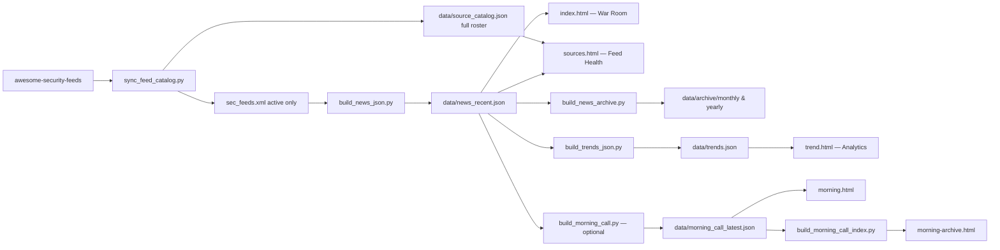

# S33R Security News Feed

[](https://github.com/clivoa/S33R/actions/workflows/update_news_json.yml)
[](https://github.com/clivoa/S33R/actions/workflows/build_news_archive.yml)
[](LICENSE.md)


A fully automated, open-source **cybersecurity news aggregation, classification, archiving, and analytics platform** designed to run entirely on **GitHub Pages + GitHub Actions** — no servers, no databases.

S33R syncs its feed roster from [clivoa/awesome-security-feeds](https://github.com/clivoa/awesome-security-feeds), ingests only feeds marked active upstream, classifies content using Smart Groups, scores and ranks every item, tracks feed health, generates historical archives, and delivers multiple front-end dashboards for analysts, researchers, and OSINT practitioners.

---

## Executive Summary

S33R provides:

- A fast, filterable **War Room dashboard** with live metric cards (24h, 7d, hot items, CVEs)
- **Score bars** on every news card with configurable time windows (24h / 72h / 7d / All)
- **Smart Group classification** for high-signal grouping
- **Curated intelligence flags** on high-priority items
- **Source Health Monitor** — full upstream feed catalog, including inactive feeds, with upstream status, quality grades, and per-feed metrics
- **Trend analytics** (keywords, vendors, actor timelines, CVEs, daily volume)
- **Historical archive engine** (monthly + yearly JSON)
- **Signal-filtered monthly packs**
- Optional **automated morning call briefing** (LLM-agnostic) with full archive
- 100% static deployment compatible with GitHub Pages

The system targets: cybersecurity analysts, threat intelligence teams, researchers and educators, OSINT practitioners, and community threat monitoring projects.

---

## Architecture Overview

```
awesome-security-feeds catalog → active OPML → Python ETL → JSON Datasets → GitHub Pages → Dashboards (HTML/JS)
```

**Components:**
- Python ingestion & data processing (`scripts/`)
- GitHub Actions (automation & scheduling, `.github/workflows/`)
- Static JSON datasets under `data/`
- Dashboards built with plain HTML + JavaScript (no frameworks, no CDN dependencies)

All functionality is delivered without servers or databases.

---

## Data Flow

```
clivoa/awesome-security-feeds
     ↓
sync_feed_catalog.py
     ↓  ── sec_feeds.xml (active feeds only, used for ingestion)
     ↓  ── data/source_catalog.json (full roster, including inactive feeds)
sec_feeds.xml
     ↓
build_news_json.py
     ↓  ── items (scored, classified, deduped)
     ↓  ── source_quality (feeds with collected items, graded A–D)
     ↓  ── feed_attempts (ingested active feeds + synthetic inactive catalog records)
data/news_recent.json
     ├── index.html         (War Room dashboard)
     ├── sources.html       (Source Health Monitor, full upstream catalog)
     │
     ├── build_news_archive.py → data/archive/monthly + yearly
     │        ↓
     │   build_trends_json.py → data/trends.json → trend.html
     │
     └── build_morning_call.py (optional) → data/morning_call_latest.json
              ↓
         build_morning_call_index.py → data/morning_call_index.json
              ↓
         morning.html + morning-archive.html
```

### High-Level Architecture


```mermaid
flowchart LR
    Z[awesome-security-feeds] --> A[sync_feed_catalog.py]
    A --> A1[sec_feeds.xml active only]
    A --> A2[data/source_catalog.json full roster]
    A1 --> B[build_news_json.py]
    B --> C[data/news_recent.json]
    C --> D[index.html — War Room]
    A2 --> E2[sources.html — Feed Health]
    C --> E2

    C --> E[build_news_archive.py]
    E --> F[data/archive/monthly & yearly]

    C --> G[build_trends_json.py]
    G --> H[data/trends.json]
    H --> I[trend.html — Analytics]

    C --> J[build_morning_call.py — optional]
    J --> K[data/morning_call_latest.json]
    K --> L[morning.html]
    K --> M[build_morning_call_index.py]
    M --> N[morning-archive.html]
```

---

## JSON Outputs

### `data/news_recent.json`

Primary data file, rebuilt hourly. Contains:

| Field | Description |
|---|---|
| `generated_at` | ISO timestamp of last build |
| `total_items` | Total deduplicated items |
| `items[]` | Normalized entries with smart groups, curated flag, priority score, source quality score |
| `source_quality[]` | Quality report for ~220 active feeds (score 0–100, grade A–D, metrics) |
| `feed_attempts[]` | Ingestion attempt records for active feeds, plus synthetic records for inactive catalog feeds |
| `source_catalog` | Metadata about the upstream feed catalog consumed by `sync_feed_catalog.py` |
| `classification_stats` | Smart group coverage and confidence ratios |
| `source_quality_model` | Weights used for each quality component |

#### `feed_attempts` status values

| Status | Meaning |
|---|---|
| `ok` | Feed parsed, at least one entry kept |
| `empty` | Feed parsed but all entries were filtered (too old, promotional, no date) |
| `bozo` | Feed parsed with errors, no entries |
| `error` | Feed fetch or parse failed entirely |
| `active` | Upstream catalog marks the feed as active; S33R may ingest it |
| `down` | Upstream catalog marks the feed inactive; S33R skips fetching it |
| `rate_limited` | Upstream catalog observed rate limiting; S33R skips fetching it |

### `data/archive/*`

- Monthly and yearly JSON archives
- Signal-filtered monthly packs (promo-filtered)

### `data/trends.json`

Holds pre-computed analytics:
- Daily volume timeline
- Smart group distribution
- Trending keywords (stopword-filtered)
- Vendor activity
- CVE occurrence rankings
- Threat actor daily timelines

### `data/morning_call_latest.json` / `data/morning_call_index.json`

LLM-generated daily briefings and their archive index. Optional.

---

## Smart Groups Classification Engine

Keyword-driven grouping applied at ingestion (`smart_group_dictionary.json`):

- Ransomware
- CVEs / Vulnerabilities
- Exploits / PoC
- Threat Actors
- Cloud Security
- Vendor-specific categories (Microsoft, Cisco, Palo Alto, CrowdStrike, etc.)
- Crypto / Web3
- Malware families
- Supply chain / software components
- Initial access techniques

These categories power both the News Board and Trend Analytics dashboards.

---

## Source Quality Model

Each active feed receives a score (0–100) composed of weighted components:

| Component | Weight | Description |
|---|---|---|
| Freshness | 32% | Ratio of items published in the last 48h and 7d |
| Useful volume | 24% | Item count relative to expected output |
| Deduplication | 20% | Penalty for duplicate entries |
| Noise | 14% | Penalty for promotional / low-signal content |
| Classification | 10% | Smart group coverage ratio |

**Grade thresholds:** A ≥ 60 · B ≥ 45 · C ≥ 30 · D < 30

---

## Curated Intelligence Layer

S33R marks items as **curated** when they match high-signal heuristics:

- 0-day vulnerabilities
- Active exploitation reports
- Ransomware group announcements
- Supply-chain compromise
- Large-scale cyberattacks
- Cloud/SaaS breach reports

Curated items are optionally consumed by the morning call briefing generator.

---

## Dashboards

### `index.html` — War Room Feed
- **War Room header** with 4 live metric cards: 24h items, 7d items, hot items (high priority), CVEs
- Time-of-day greeting with last-updated timestamp
- **Score bars** on each card, normalized to the observed priority score range
- Hot items highlighted with a distinct border
- **Time window buttons**: 24h / 72h / 7d / All
- Search, Smart Group filter, category filter, curated-only toggle
- Infinite scroll

### `sources.html` — Source Health Monitor
- Shows the **full upstream feed catalog**, including feeds that are inactive and skipped by ingestion
- Status badges per feed: Active / Inactive / Rate Limited / Fetched / Empty / Error / Bozo
- Quality grade (A–D) and score bar for feeds with collected items
- Per-feed metrics: total items, fresh 48h/7d, curated, duplicates, noise
- Filters: search, status, grade, sort (rank / score / name / status / items / fresh)

### `trend.html` — Trend Analytics
- Chart.js visualizations
- Time window selector (24h / 7d / 30d / 90d)
- Daily volume, smart group breakdown, trending keywords, vendor activity, CVEs, threat actor timelines

### `archive.html` — Historical Archive
- Browse monthly and yearly archives
- Search historical data
- Group entries by source

### `archive-overview.html` — Archive Overview
- High-level view across all archived periods

### `history.html` — History
- Browsable historical data timeline

### `morning.html` — Morning Call (Optional)
- Renders the latest LLM-generated daily briefing
- No AI provider required by default

### `morning-archive.html` — Morning Call Archive (Optional)
- Index of all past morning call briefings with metadata and stats

---

## Optional: Automated Morning Call (LLM-agnostic)

S33R supports an optional module for generating a **cybersecurity daily briefing**:

- Disabled by default
- Works with **any** LLM provider (OpenAI, Anthropic, Gemini, local models, etc.)
- Developers define the persona, structure, tone, and summary rules via `persona.txt`
- Friendly for research, newsletters, or automated reporting workflows

Outputs:
```
data/morning_call_latest.json
data/archive/morning_call/<YYYY>/<MM>/morning_call_YYYY-MM-DD.json
data/morning_call_index.json
```

Example workflow env variable:
```yaml
# Optional — only needed if using build_morning_call.py
# LLM_API_KEY: ${{ secrets.LLM_API_KEY }}
# LLM_MODEL: "provider/model-name"
```

---

## GitHub Actions Automation

### `update_news_json.yml` (Hourly)
- Syncs the upstream catalog and active-only OPML from `clivoa/awesome-security-feeds`
- Fetches only feeds marked active upstream
- Builds `news_recent.json` with items, `source_quality`, and `feed_attempts`
- Creates signal-filtered promo fragment archive

### `build_news_archive.yml` (Daily)
- Updates monthly and yearly archives
- Consolidates signal-filtered packs
- Rebuilds `trends.json`
- Optionally rebuilds morning call index

### `morning_call.yml` (Optional, configurable schedule)
- Runs an LLM-powered SOC morning call if `LLM_API_KEY` is configured
- Stores output in daily archive structure

All workflows run with standard GitHub Actions runners.

---

## Project Structure

```
S33R/
│
├── index.html                  # War Room feed dashboard
├── sources.html                # Source Health Monitor (full upstream catalog)
├── trend.html                  # Trend analytics
├── archive.html                # Historical archive browser
├── archive-overview.html       # Archive overview
├── history.html                # History timeline
├── morning.html                # Morning call (optional)
├── morning-archive.html        # Morning call archive index (optional)
│
├── styles.css                  # Shared design system
├── ui.js                       # Shared UI utilities
│
├── _config.yml
├── _config.local.yml           # Local-only override (not committed to production)
├── Gemfile / Gemfile.lock
├── persona.txt                 # LLM persona definition for morning call
│
├── data/
│   ├── news_recent.json        # Primary feed (rebuilt hourly)
│   ├── source_catalog.json     # Full upstream feed roster + status
│   ├── trends.json             # Analytics data
│   ├── morning_call_latest.json
│   ├── morning_call_index.json
│   └── archive/
│       ├── yearly/
│       ├── monthly/
│       ├── morning_call/
│       │   └── <YYYY>/<MM>/
│       └── promo/
│           └── monthly/
│
├── scripts/
│   ├── sync_feed_catalog.py        # Sync upstream active OPML + full source catalog
│   ├── build_news_json.py          # Main ETL: fetch, classify, score, write JSON
│   ├── build_news_archive.py       # Archive builder
│   ├── build_trends_json.py        # Trend analytics builder
│   ├── build_morning_call.py       # LLM briefing generator (optional)
│   ├── build_morning_call_index.py # Morning call archive indexer
│   ├── build_historical_trends.py  # Historical trend computations
│   └── smart_group_dictionary.json # Keyword rules for classification
│
├── sec_feeds.xml               # Active-only OPML generated from awesome-security-feeds
│
└── .github/
    └── workflows/
        ├── update_news_json.yml
        ├── build_news_archive.yml
        └── morning_call.yml        # Optional
```

---

## Local Development

Clone:

```bash
git clone https://github.com/clivoa/S33R.git
cd S33R
```

Run pipelines manually:

```bash
python scripts/build_news_json.py
python scripts/build_news_archive.py
python scripts/build_trends_json.py
# optional:
# python scripts/build_morning_call.py
# python scripts/build_morning_call_index.py
```

Install Jekyll dependencies:

```bash
bundle install
```

Serve locally with Jekyll (required to process Liquid tags like `{{ ... | relative_url }}`):

```bash
bundle exec jekyll serve --config _config.yml,_config.local.yml
```

Open:

```
http://127.0.0.1:4000/
```

> **Note:** Do not use `python -m http.server` — it does not render Jekyll/Liquid templates. `_site/` is build output only and should not be committed.

---

## Example Use Cases

- OSINT monitoring
- Cybersecurity research
- CVE and exploit tracking
- Vendor advisory analysis
- Community threat dashboards
- Automated newsletters
- Historical dataset building

---

## Roadmap

- ML-based feed quality scoring
- Automatic topic clustering
- Heatmaps for actor/CVE correlation
- Bookmarks and saved filters
- Multi-tenant feed profiles
- Exportable snapshots (PDF/MD)
- IOC extractor utility page
- Global cross-dataset search

---

## License

MIT — free for personal, commercial, or research use.

---

**S33R — Open Cyber Threat Intelligence, Automated and Accessible.**
